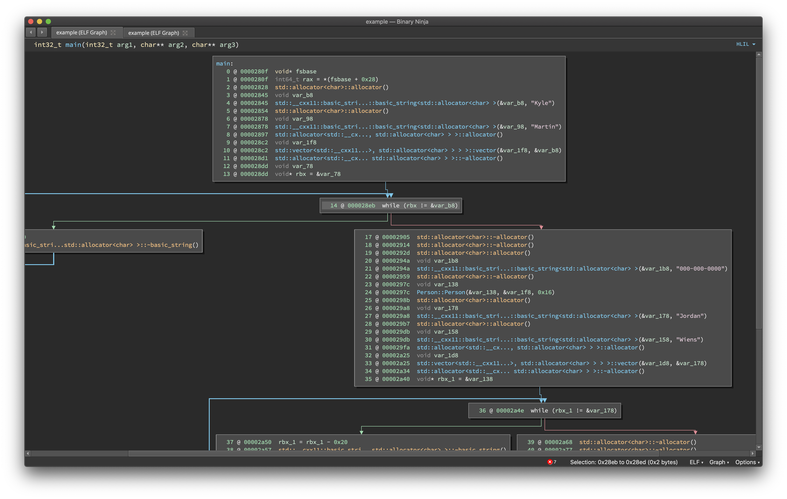
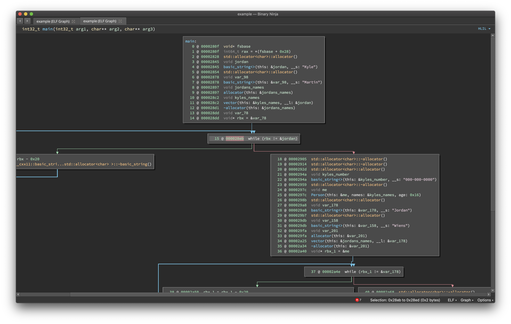

# DWARF Import (v1.0.0)
Author: **Vector 35 Inc**

_Imports DWARF Info from ELFs_

## Description:

This loads DWARF info from an ELF and propagates function names, arguments, and type info

### Analysis Without DWARF info:

### Analysis With DWARF info:

## Minimum Version

This plugin requires the following minimum version of Binary Ninja:

* 1904

## Required Dependencies

The following dependencies are required for this plugin:

 * pip - pyelftools

## License

This plugin is released under a MIT license.
## Metadata Version

2
